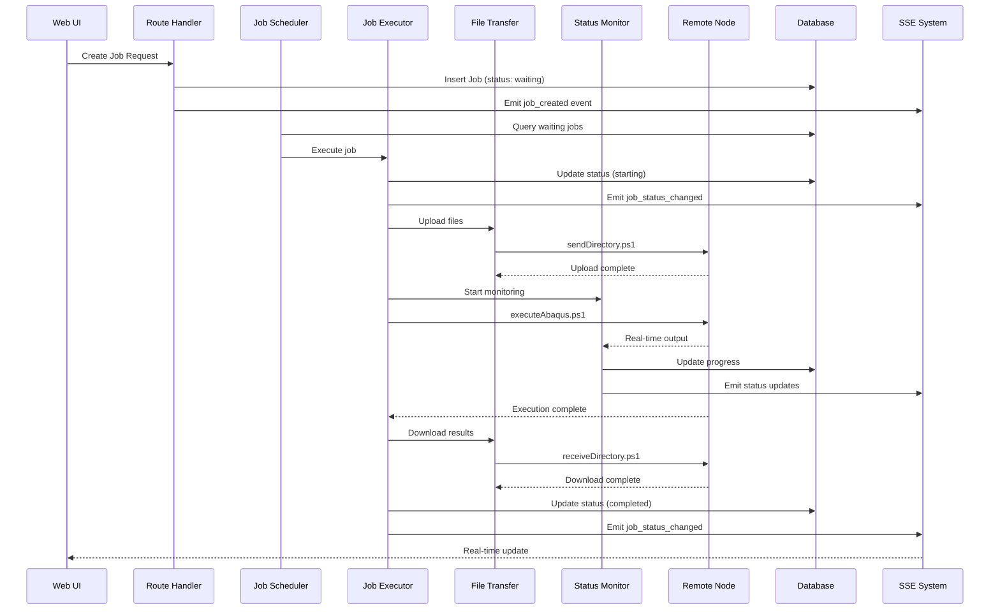
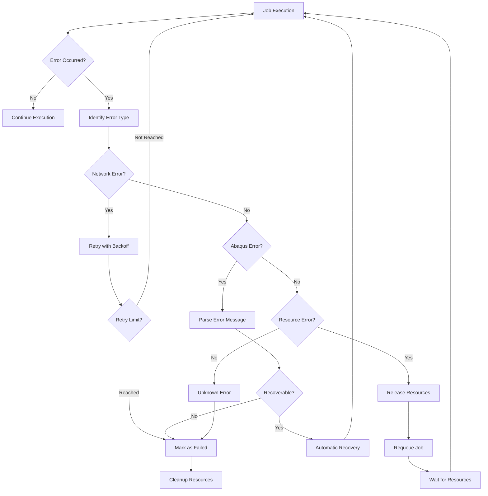

# Abaqus ジョブ実行システム技術アーキテクチャ

## 📐 システムアーキテクチャ概要

本ドキュメントでは、Abaqus Job Managerにおけるジョブ実行システムの技術アーキテクチャを詳述します。既存の強力なインフラストラクチャを活用し、効率的で安全なジョブ実行システムを構築します。

## 🏗️ 全体アーキテクチャ図

```
┌─────────────────────────────────────────────────────────────────┐
│                        Web Browser (Client)                     │
├─────────────────────────────────────────────────────────────────┤
│  React Components                                               │
│  ┌─────────────────┐  ┌─────────────────┐  ┌─────────────────┐ │
│  │ JobTable        │  │ JobDetailModal  │  │ ResourceMonitor │ │
│  │ (Status Display)│  │ (Progress View) │  │ (Admin Panel)   │ │
│  └─────────────────┘  └─────────────────┘  └─────────────────┘ │
└─────────────────────────────────────────────────────────────────┘
                                 │
                                 │ SSE Events
                                 ▼
┌─────────────────────────────────────────────────────────────────┐
│                    React Router v7 Server                      │
├─────────────────────────────────────────────────────────────────┤
│  Route Handlers                                                 │
│  ┌─────────────────┐  ┌─────────────────┐  ┌─────────────────┐ │
│  │ _index.tsx      │  │ admin.*.tsx     │  │ api.events.ts   │ │
│  │ (Job CRUD)      │  │ (Admin Panel)   │  │ (SSE Endpoint)  │ │
│  └─────────────────┘  └─────────────────┘  └─────────────────┘ │
└─────────────────────────────────────────────────────────────────┘
                                 │
                                 │ Service Layer
                                 ▼
┌─────────────────────────────────────────────────────────────────┐
│                      Service Layer                              │
├─────────────────────────────────────────────────────────────────┤
│  ┌─────────────────────────────────────────────────────────────┐ │
│  │              Job Execution Services (簡素化版)             │ │
│  │                                                             │ │
│  │                  ┌─────────────────────┐                   │ │
│  │                  │   AbaqusJobRunner   │                   │ │
│  │                  │   (統合クラス)       │                   │ │
│  │                  │ - ファイル転送       │                   │ │
│  │                  │ - Abaqus実行        │                   │ │
│  │                  │ - ステータス監視      │                   │ │
│  │                  │ - エラーハンドリング   │                   │ │
│  │                  └─────────────────────┘                   │ │
│  │                                                             │ │
│  └─────────────────────────────────────────────────────────────┘ │
│                                                                 │
│  ┌─────────────────────────────────────────────────────────────┐ │
│  │                Existing Services                            │ │
│  │  ┌─────────────────┐  ┌─────────────────┐  ┌─────────────┐ │ │
│  │  │remote-pwsh      │  │SSE System       │  │License Calc.│ │ │
│  │  │(SSH/PowerShell) │  │(Real-time)      │  │(Token Mgmt) │ │ │
│  │  └─────────────────┘  └─────────────────┘  └─────────────┘ │ │
│  │                                                             │ │
│  │  ┌─────────────────┐  ┌─────────────────┐  ┌─────────────┐ │ │
│  │  │Scheduler System │  │Database Ops     │  │Logger System│ │ │
│  │  │(Queue Processing│  │(Type-safe CRUD) │  │(Structured) │ │ │
│  │  └─────────────────┘  └─────────────────┘  └─────────────┘ │ │
│  └─────────────────────────────────────────────────────────────┘ │
└─────────────────────────────────────────────────────────────────┘
                                 │
                                 │ Remote Execution
                                 ▼
┌─────────────────────────────────────────────────────────────────┐
│                    Remote Nodes (Windows)                      │
├─────────────────────────────────────────────────────────────────┤
│  PowerShell Scripts                                             │
│  ┌─────────────────┐  ┌─────────────────┐  ┌─────────────────┐ │
│  │executeAbaqus.ps1│  │sendDirectory.ps1│  │recieveDirectory │ │
│  │(Job Execution)  │  │(File Upload)    │  │(Result Download)│ │
│  └─────────────────┘  └─────────────────┘  └─────────────────┘ │
│                                                                 │
│  ┌─────────────────┐  ┌─────────────────┐  ┌─────────────────┐ │
│  │Working Directory│  │Abaqus Software  │  │Result Files     │ │
│  │(Job Files)      │  │(Solver)         │  │(.sta/.dat/.odb) │ │
│  └─────────────────┘  └─────────────────┘  └─────────────────┘ │
└─────────────────────────────────────────────────────────────────┘
```

## 🔧 コンポーネント詳細設計（簡素化版）

### **1. AbaqusJobRunner (統合ジョブ実行クラス)**

```typescript
// /app/app/lib/services/abaqus/abaqus-job-runner.server.ts
interface AbaqusJobRunner {
  // メインジョブ実行メソッド
  executeJob(job: Job, node: Node): Promise<JobExecutionResult>;
  
  // 統合されたワークフロー制御
  private uploadFiles(job: Job, node: Node): Promise<string>; // シリアル処理
  private runAbaqus(job: Job, node: Node, remotePath: string): Promise<void>; // 並列可能
  private downloadResults(job: Job, node: Node): Promise<string[]>; // シリアル処理
  private updateJobStatus(jobId: number, status: string, message?: string): Promise<void>;
  
  // 🚨 重要: ファイル転送シリアル処理制御
  private static fileTransferQueue: Map<string, Promise<void>>; // ノード別転送キュー
  private static readonly maxConcurrentTransfers = 1; // 転送並列数制限
}

interface JobExecutionResult {
  success: boolean;
  jobId: number;
  executionTime: number;
  outputFiles: string[];
  errorMessage?: string;
}
```

**主要機能**:
- **1つのクラス**で完結するジョブ実行システム
- 既存remote-pwshライブラリとの統合
- **ファイル転送シリアル処理**の確実な実装
- 基本的なエラーハンドリング
- 既存PowerShellスクリプト活用

**🚨 重要なシリアル処理要件**:
- **ファイル転送**: 準備段階（アップロード）と結果取得段階（ダウンロード）は**シリアル処理**
- **Abaqus実行**: 解析段階は**並列処理**可能
- **理由**: ネットワーク帯域制限、ディスクI/O制限、SSH接続制限、ストレージ容量管理

**PowerShellスクリプト統合**:
- `sendDirectory.ps1`: ローカルからリモートへのディレクトリ転送
- `receiveDirectory.ps1`: リモートからローカルへのディレクトリ転送
- PSSession再利用による効率的なファイル転送
- ノード別転送キューによるシリアル処理制御

### **2. 既存サービスとの統合**

**AbaqusJobRunner**は以下の既存サービスを活用：

```typescript
// 既存サービス統合
class AbaqusJobRunner {
  constructor(
    private remotePwshExecutor: RemotePwshExecutor,
    private jobOperations: JobOperations,
    private sseEmitter: SSEEmitter
  ) {}
  
  // 既存remote-pwshライブラリ活用
  private async executePowerShellScript(
    scriptPath: string,
    args: string[]
  ): Promise<RemotePwshResult> {
    return await this.remotePwshExecutor.invokeAsync();
  }
  
  // 既存データベース操作活用
  private async updateJobStatus(
    jobId: number,
    status: string,
    message?: string
  ): Promise<void> {
    await this.jobOperations.updateJobStatus(jobId, status, message);
  }
  
  // 既存SSE発信活用
  private async emitJobStatusUpdate(job: Job): Promise<void> {
    this.sseEmitter.emit('jobs', {
      type: 'job_status_changed',
      data: { jobId: job.id, status: job.status }
    });
  }
}
```

**統合されるサービス**:
- **remote-pwshライブラリ**: PowerShellスクリプト実行
- **データベース操作**: ジョブステータス更新
- **SSEイベント**: リアルタイム通知
- **既存PowerShellスクリプト**: ファイル転送・Abaqus実行

**必要に応じて追加される機能**:
- **基本的なキューシステム**: 既存スケジューラー活用
- **簡単なリソース確認**: CPUコア・ライセンス確認
- **基本的なエラーハンドリング**: 失敗時の処理
}
```

**簡素化による利点**:
- **保守性**: 1つのクラスで完結
- **理解しやすさ**: 複雑な依存関係なし
- **トラブルシューティング**: 問題箇所の特定が容易
- **拡張性**: 必要に応じて機能追加可能

## 🔄 データフロー設計

### **1. ジョブ実行フロー**



### **2. エラー処理フロー**



## 🗃️ データベース設計

### **既存スキーマ活用**

```sql
-- Jobs table (既存)
CREATE TABLE jobs (
    id INTEGER PRIMARY KEY AUTOINCREMENT,
    name TEXT NOT NULL,
    status TEXT NOT NULL CHECK (status IN ('waiting', 'starting', 'running', 'completed', 'failed', 'missing')),
    node_id INTEGER REFERENCES nodes(id),
    file_id INTEGER NOT NULL REFERENCES file_records(id),
    user_id INTEGER NOT NULL REFERENCES users(id),
    cpu_cores INTEGER NOT NULL CHECK (cpu_cores > 0),
    priority TEXT NOT NULL DEFAULT 'normal' CHECK (priority IN ('low', 'normal', 'high', 'urgent')),
    start_time TEXT,
    end_time TEXT,
    error_message TEXT,
    output_file_path TEXT,
    created_at TEXT NOT NULL DEFAULT CURRENT_TIMESTAMP,
    updated_at TEXT NOT NULL DEFAULT CURRENT_TIMESTAMP
);

-- Job Logs table (既存)
CREATE TABLE job_logs (
    id INTEGER PRIMARY KEY AUTOINCREMENT,
    job_id INTEGER NOT NULL REFERENCES jobs(id),
    log_level TEXT NOT NULL CHECK (log_level IN ('info', 'warning', 'error', 'debug')),
    message TEXT NOT NULL,
    details TEXT,
    created_at TEXT NOT NULL DEFAULT CURRENT_TIMESTAMP
);
```

### **新規テーブル（必要に応じて）**

```sql
-- Job Execution Details (optional)
CREATE TABLE job_executions (
    id INTEGER PRIMARY KEY AUTOINCREMENT,
    job_id INTEGER NOT NULL REFERENCES jobs(id),
    node_id INTEGER NOT NULL REFERENCES nodes(id),
    execution_start TEXT NOT NULL,
    execution_end TEXT,
    progress_percentage INTEGER DEFAULT 0,
    memory_usage INTEGER,
    cpu_usage INTEGER,
    stdout_log TEXT,
    stderr_log TEXT,
    created_at TEXT NOT NULL DEFAULT CURRENT_TIMESTAMP
);
```

## 🔌 SSE イベント設計

### **新規イベント定義**

```typescript
// /app/app/lib/services/sse/sse-schemas.ts (拡張)
export const EVENT_TYPES = {
  // 既存イベント
  JOB_CREATED: 'job_created',
  JOB_UPDATED: 'job_updated',
  JOB_DELETED: 'job_deleted',
  JOB_STATUS_CHANGED: 'job_status_changed',
  
  // 新規実行イベント
  JOB_EXECUTION_STARTED: 'job_execution_started',
  JOB_EXECUTION_PROGRESS: 'job_execution_progress',
  JOB_EXECUTION_COMPLETED: 'job_execution_completed',
  JOB_EXECUTION_FAILED: 'job_execution_failed',
  
  // リソースイベント
  RESOURCE_ALLOCATED: 'resource_allocated',
  RESOURCE_RELEASED: 'resource_released',
  NODE_CAPACITY_CHANGED: 'node_capacity_changed',
} as const;

interface JobExecutionProgressData {
  jobId: number;
  jobName: string;
  nodeId: number;
  progress: number; // 0-100
  currentStep: string;
  timeRemaining?: number;
  memoryUsage?: number;
}
```

## 🏢 サービス依存関係

### **依存関係マップ**

```
AbaqusJobExecutor
├── FileTransferService
│   ├── remote-pwsh (existing)
│   └── PowerShell Scripts
├── JobStatusMonitor
│   ├── SSE System (existing)
│   └── Database Operations (existing)
├── ResourceManager
│   ├── License Calculator (existing)
│   └── Node Operations (existing)
└── ErrorRecovery
    ├── Logger System (existing)
    └── Database Operations (existing)

JobExecutionScheduler
├── AbaqusJobExecutor
├── Scheduler System (existing)
└── Resource Manager
```

### **インターフェース統合**

```typescript
// Service Factory Pattern
export class AbaqusExecutionServiceFactory {
  static createJobExecutor(
    transferService: FileTransferService,
    statusMonitor: JobStatusMonitor,
    resourceManager: ResourceManager
  ): AbaqusJobExecutor {
    return new AbaqusJobExecutorImpl(
      transferService,
      statusMonitor,
      resourceManager
    );
  }
}

// Dependency Injection Pattern
export interface AbaqusExecutionServices {
  jobExecutor: AbaqusJobExecutor;
  fileTransfer: FileTransferService;
  statusMonitor: JobStatusMonitor;
  resourceManager: ResourceManager;
  errorRecovery: ErrorRecoveryService;
}
```

## 🛡️ セキュリティ設計

### **認証・認可**

```typescript
// Job Execution Authorization
interface JobExecutionAuth {
  validateJobOwnership(jobId: number, userId: number): Promise<boolean>;
  checkNodeAccess(nodeId: number, userId: number): Promise<boolean>;
  validateResourceLimits(job: Job, user: User): Promise<boolean>;
}

// Secure File Transfer
interface SecureFileTransfer {
  validateFileIntegrity(file: FileRecord): Promise<boolean>;
  encryptSensitiveData(data: any): Promise<string>;
  sanitizeFilePaths(paths: string[]): string[];
}
```

### **監査ログ**

```typescript
// Execution Audit Log
interface ExecutionAuditLog {
  logJobExecution(job: Job, user: User, action: string): Promise<void>;
  logResourceAllocation(allocation: ResourceAllocation): Promise<void>;
  logFileTransfer(transfer: FileTransferResult): Promise<void>;
}
```

## 📊 パフォーマンス設計

### **最適化戦略**

1. **コネクションプーリング**: SSH接続の再利用
2. **並行処理**: 複数ジョブの同時実行
3. **キャッシュ**: ノード情報とリソース状態
4. **バッチ処理**: 複数ファイルの一括転送

### **メモリ管理**

```typescript
// Resource Pool Management
interface ResourcePool {
  acquireConnection(nodeId: number): Promise<PSSession>;
  releaseConnection(session: PSSession): Promise<void>;
  cleanupIdleConnections(): Promise<void>;
}

// Memory Monitoring
interface MemoryMonitor {
  trackJobMemoryUsage(jobId: number): Promise<void>;
  alertOnHighMemoryUsage(threshold: number): Promise<void>;
  cleanupCompletedJobs(): Promise<void>;
}
```

## 🔍 監視・メトリクス

### **システムメトリクス**

```typescript
// Execution Metrics
interface ExecutionMetrics {
  totalJobsExecuted: number;
  averageExecutionTime: number;
  successRate: number;
  resourceUtilization: number;
  errorRate: number;
}

// Performance Monitoring
interface PerformanceMonitor {
  collectExecutionMetrics(): Promise<ExecutionMetrics>;
  generatePerformanceReport(): Promise<PerformanceReport>;
  alertOnPerformanceIssues(): Promise<void>;
}
```

この技術アーキテクチャにより、既存の強力なインフラストラクチャを最大限活用しながら、安全で効率的なAbaqusジョブ実行システムを構築できます。