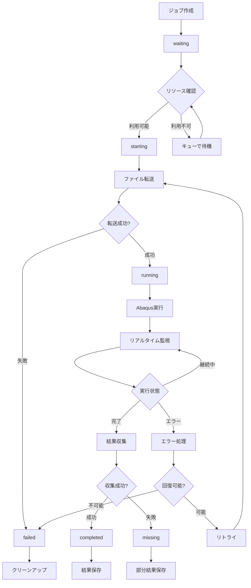

# Abaqus ジョブ実行ワークフロー

## 📋 概要

このドキュメントでは、Abaqus Job Managerにおけるジョブ実行の完全なワークフローを詳述します。ジョブ作成から完了まで、すべてのステップと状態遷移、エラーハンドリング手順を包括的に説明します。

## 🔄 ジョブライフサイクル全体図



## 📊 ジョブステータス詳細

### **1. waiting (待機中)**
- **説明**: ジョブが作成され、実行待機中
- **条件**: 
  - ジョブが正常に作成された
  - 必要なファイルが存在する
  - 実行可能な状態にある
- **次の状態**: `starting` または継続して `waiting`

### **2. starting (開始中)**
- **説明**: ジョブ実行準備中
- **処理内容**:
  - リソース割り当て確認
  - 実行ノード選択
  - 実行環境準備
- **次の状態**: `running` または `failed`

### **3. running (実行中)**
- **説明**: Abaqus実行中
- **処理内容**:
  - ファイル転送
  - Abaqus実行
  - リアルタイム監視
- **次の状態**: `completed`, `failed`, または `missing`

### **4. completed (完了)**
- **説明**: ジョブが正常に完了
- **条件**:
  - Abaqus実行が正常終了
  - 結果ファイルが正常に収集された
  - 全ての処理が完了
- **最終状態**: これ以上の遷移なし

### **5. failed (失敗)**
- **説明**: ジョブが失敗
- **原因**:
  - Abaqus実行エラー
  - ファイル転送エラー
  - リソース不足
  - ネットワークエラー
- **最終状態**: これ以上の遷移なし

### **6. missing (結果不完全)**
- **説明**: Abaqus実行は完了したが、結果収集が不完全
- **原因**:
  - 結果ファイル転送エラー
  - 部分的なファイル損失
  - ストレージエラー
- **最終状態**: これ以上の遷移なし

## 🔧 詳細実行ワークフロー

### **Phase 1: ジョブ準備・検証**

#### **1.1 ジョブ作成**
```typescript
// ジョブ作成処理
async function createJob(jobData: JobCreationData): Promise<Job> {
  // 1. 入力検証
  const validatedData = await validateJobData(jobData);
  
  // 2. ファイル検証
  const fileValidation = await validateInputFile(jobData.fileId);
  if (!fileValidation.valid) {
    throw new Error(`Invalid input file: ${fileValidation.error}`);
  }
  
  // 3. リソース事前確認
  const resourceCheck = await checkResourceAvailability(jobData.cpuCores);
  if (!resourceCheck.available) {
    // 警告表示（実行は可能）
    console.warn('Resources may be limited');
  }
  
  // 4. データベース挿入
  const job = await jobOperations.create({
    ...validatedData,
    status: 'waiting',
    created_at: new Date().toISOString()
  });
  
  // 5. SSEイベント発信
  await emitSSE('jobs', {
    type: 'job_created',
    data: { jobId: job.id, jobName: job.name }
  });
  
  return job;
}
```

#### **1.2 キュー管理**
```typescript
// ジョブキュー処理
async function processJobQueue(): Promise<void> {
  // 1. 待機中ジョブ取得
  const waitingJobs = await jobOperations.findByStatus('waiting');
  
  // 2. 優先度順ソート
  const sortedJobs = waitingJobs.sort((a, b) => {
    const priorityOrder = { 'urgent': 4, 'high': 3, 'normal': 2, 'low': 1 };
    return priorityOrder[b.priority] - priorityOrder[a.priority];
  });
  
  // 3. 各ジョブの実行可能性確認
  for (const job of sortedJobs) {
    const canExecute = await checkJobExecutability(job);
    if (canExecute.ready) {
      await initiateJobExecution(job, canExecute.node);
    }
  }
}
```

### **Phase 2: リソース割り当て・実行準備**

#### **2.1 リソース確認**
```typescript
// リソース可用性確認
async function checkJobExecutability(job: Job): Promise<ExecutabilityCheck> {
  // 1. 利用可能ノード取得
  const availableNodes = await getAvailableNodes();
  
  // 2. 各ノードの容量確認
  for (const node of availableNodes) {
    const capacity = await getNodeCapacity(node.id);
    const requiredTokens = calculateRequiredTokens(job.cpu_cores);
    
    if (capacity.availableCpuCores >= job.cpu_cores &&
        capacity.availableLicenseTokens >= requiredTokens) {
      return {
        ready: true,
        node: node,
        estimatedStartTime: new Date()
      };
    }
  }
  
  return {
    ready: false,
    reason: 'Insufficient resources',
    estimatedWaitTime: await estimateWaitTime(job)
  };
}
```

#### **2.2 実行開始**
```typescript
// ジョブ実行開始
async function initiateJobExecution(job: Job, node: Node): Promise<void> {
  try {
    // 1. ステータス更新
    await updateJobStatus(job.id, 'starting');
    
    // 2. リソース割り当て
    await allocateResources(job, node);
    
    // 3. 実行開始
    await executeJob(job, node);
    
  } catch (error) {
    await handleJobError(job, error);
  }
}
```

### **Phase 3: ファイル転送** 🚨 **シリアル処理要件**

#### **3.1 ファイルアップロード（シリアル処理）**
```typescript
// ジョブファイル転送（シリアル処理）
async function transferJobFiles(job: Job, node: Node): Promise<TransferResult> {
  // 🚨 重要: ファイル転送は必ずシリアル処理
  // 理由: ネットワーク帯域制限、ディスクI/O制限、SSH接続制限、ストレージ容量管理
  
  // 1. ローカルファイルパス取得
  const localPath = await getJobFilePath(job);
  
  // 2. リモート作業ディレクトリ作成
  const remoteWorkDir = await createRemoteWorkingDirectory(job, node);
  
  // 3. ファイル転送実行（ノード別転送キューでシリアル処理）
  const transferResult = await fileTransferService.uploadJobFiles(job, node);
  
  if (!transferResult.success) {
    throw new Error(`File transfer failed: ${transferResult.error}`);
  }
  
  // 4. 転送完了ログ
  await logJobEvent(job.id, 'info', 'File transfer completed', {
    transferTime: transferResult.transferTime,
    fileSize: transferResult.fileSize,
    remotePath: transferResult.remotePath
  });
  
  return transferResult;
}
```

#### **3.2 作業ディレクトリ管理**
```typescript
// リモート作業ディレクトリ作成
async function createRemoteWorkingDirectory(job: Job, node: Node): Promise<string> {
  const workingDir = `/tmp/abaqus_jobs/job_${job.id}_${Date.now()}`;
  
  // PowerShell経由でディレクトリ作成
  const executor = createRemotePwshExecutor({
    host: node.hostname,
    user: 'lab',
    scriptPath: createDirectoryScript(workingDir)
  });
  
  const result = await executor.invokeAsync();
  
  if (result.returnCode !== 0) {
    throw new Error(`Failed to create working directory: ${result.stderr}`);
  }
  
  return workingDir;
}
```

### **Phase 4: Abaqus実行・監視**

#### **4.1 Abaqus実行開始**
```typescript
// Abaqus実行
async function executeAbaqusJob(job: Job, node: Node, workingDir: string): Promise<ExecutionResult> {
  // 1. ステータス更新
  await updateJobStatus(job.id, 'running');
  
  // 2. 実行パラメータ準備
  const jobName = `job_${job.id}`;
  const inputFile = await getInputFileName(job);
  const cpuCores = job.cpu_cores;
  
  // 3. PowerShell実行
  const executor = createRemotePwshExecutor({
    host: node.hostname,
    user: 'lab',
    scriptPath: '/app/resources/ps-scripts/executeAbaqus.ps1'
  });
  
  // 4. リアルタイム監視開始
  const monitor = await startJobMonitoring(job, executor);
  
  // 5. 実行開始
  const startTime = Date.now();
  
  try {
    const result = await executor.invokeAsync();
    
    if (result.returnCode === 0) {
      return {
        success: true,
        executionTime: Date.now() - startTime,
        outputLog: result.stdout,
        errorLog: result.stderr
      };
    } else {
      throw new Error(`Abaqus execution failed: ${result.stderr}`);
    }
  } finally {
    await stopJobMonitoring(job.id);
  }
}
```

#### **4.2 リアルタイム監視**
```typescript
// ジョブ監視開始
async function startJobMonitoring(job: Job, executor: RemotePwshExecutor): Promise<MonitorSession> {
  const session = {
    jobId: job.id,
    startTime: Date.now(),
    lastHeartbeat: Date.now()
  };
  
  // stdout監視
  executor.on('stdout', (line: string) => {
    // 進捗情報抽出
    const progress = parseAbaqusProgress(line);
    if (progress) {
      updateJobProgress(job.id, progress);
    }
    
    // 重要メッセージ検出
    const importance = classifyLogMessage(line);
    if (importance === 'high') {
      logJobEvent(job.id, 'info', line);
    }
    
    // SSEイベント発信
    emitProgressUpdate(job.id, progress, line);
  });
  
  // stderr監視
  executor.on('stderr', (line: string) => {
    logJobEvent(job.id, 'warning', line);
    
    // エラーレベル判定
    if (isCriticalError(line)) {
      emitErrorAlert(job.id, line);
    }
  });
  
  return session;
}
```

#### **4.3 進捗解析**
```typescript
// Abaqus進捗解析
function parseAbaqusProgress(output: string): ProgressInfo | null {
  // Step進捗
  const stepMatch = output.match(/Step\s+(\d+)\s+of\s+(\d+)/i);
  if (stepMatch) {
    const current = parseInt(stepMatch[1]);
    const total = parseInt(stepMatch[2]);
    return {
      type: 'step',
      current: current,
      total: total,
      percentage: Math.round((current / total) * 100),
      message: `Step ${current} of ${total}`
    };
  }
  
  // 増分進捗
  const incrementMatch = output.match(/Increment\s+(\d+)\s+of\s+(\d+)/i);
  if (incrementMatch) {
    const current = parseInt(incrementMatch[1]);
    const total = parseInt(incrementMatch[2]);
    return {
      type: 'increment',
      current: current,
      total: total,
      percentage: Math.round((current / total) * 100),
      message: `Increment ${current} of ${total}`
    };
  }
  
  // 全体進捗
  const percentMatch = output.match(/(\d+)%\s+complete/i);
  if (percentMatch) {
    const percentage = parseInt(percentMatch[1]);
    return {
      type: 'overall',
      percentage: percentage,
      message: `${percentage}% complete`
    };
  }
  
  return null;
}
```

### **Phase 5: 結果収集・完了処理** 🚨 **シリアル処理要件**

#### **5.1 結果ファイル収集（シリアル処理）**
```typescript
// 結果ファイル収集（シリアル処理）
async function collectJobResults(job: Job, node: Node, workingDir: string): Promise<ResultCollection> {
  // 🚨 重要: 結果収集もシリアル処理
  // 理由: ネットワーク帯域制限、ディスクI/O制限、大容量結果ファイルの効率的転送
  
  // 1. 結果ファイル一覧取得
  const resultFiles = await listRemoteResultFiles(node, workingDir);
  
  // 2. ローカル結果ディレクトリ作成
  const localResultDir = await createLocalResultDirectory(job);
  
  // 3. ファイル転送（ノード別転送キューでシリアル処理）
  const downloadResult = await fileTransferService.downloadResults(job, node);
  
  if (!downloadResult.success) {
    // 部分的な結果でも保存
    await updateJobStatus(job.id, 'missing', 'Results partially collected');
    return {
      success: false,
      partialResults: downloadResult.partialFiles || [],
      error: downloadResult.error
    };
  }
  
  // 4. 結果ファイル検証
  const validation = await validateResultFiles(downloadResult.resultFiles);
  
  // 5. データベース更新
  await updateJobResults(job.id, {
    outputFilePath: localResultDir,
    resultFiles: downloadResult.resultFiles,
    executionStats: validation.stats
  });
  
  return {
    success: true,
    resultFiles: downloadResult.resultFiles,
    resultDirectory: localResultDir
  };
}
```

#### **5.2 完了処理**
```typescript
// ジョブ完了処理
async function completeJob(job: Job, executionResult: ExecutionResult, resultCollection: ResultCollection): Promise<void> {
  // 1. 最終ステータス更新
  await updateJobStatus(job.id, 'completed', 'Job completed successfully');
  
  // 2. 実行時間記録
  await updateJobTiming(job.id, {
    endTime: new Date().toISOString(),
    executionTime: executionResult.executionTime
  });
  
  // 3. リソース解放
  await releaseJobResources(job);
  
  // 4. 統計情報更新
  await updateJobStatistics(job, executionResult);
  
  // 5. SSEイベント発信
  await emitSSE('jobs', {
    type: 'job_execution_completed',
    data: {
      jobId: job.id,
      jobName: job.name,
      executionTime: executionResult.executionTime,
      resultFiles: resultCollection.resultFiles
    }
  });
  
  // 6. 完了通知
  await notifyJobCompletion(job, executionResult);
}
```

### **Phase 6: クリーンアップ**

#### **6.1 リソースクリーンアップ**
```typescript
// リソースクリーンアップ
async function cleanupJobResources(job: Job, node: Node): Promise<void> {
  try {
    // 1. リモート作業ディレクトリ削除
    await cleanupRemoteWorkingDirectory(job, node);
    
    // 2. 一時ファイル削除
    await cleanupTemporaryFiles(job);
    
    // 3. リソース割り当て解除
    await deallocateResources(job, node);
    
    // 4. 監視セッション終了
    await terminateMonitoringSession(job.id);
    
  } catch (error) {
    // クリーンアップエラーは警告レベル
    console.warn(`Cleanup warning for job ${job.id}: ${error.message}`);
  }
}
```

## ⚠️ エラーハンドリング・回復処理

### **1. エラー分類**

#### **1.1 回復可能エラー**
```typescript
// 回復可能エラー処理
async function handleRecoverableError(job: Job, error: Error): Promise<void> {
  const errorType = classifyError(error);
  
  switch (errorType) {
    case 'NetworkError':
      await retryWithBackoff(job, 'network_retry');
      break;
      
    case 'FileTransferError':
      await retryFileTransfer(job);
      break;
      
    case 'ResourceTemporaryUnavailable':
      await requeueJob(job);
      break;
      
    default:
      await markJobAsFailed(job, error);
  }
}
```

#### **1.2 重大エラー**
```typescript
// 重大エラー処理
async function handleCriticalError(job: Job, error: Error): Promise<void> {
  // 1. 即座に失敗状態に遷移
  await updateJobStatus(job.id, 'failed', error.message);
  
  // 2. 詳細エラー情報記録
  await logJobEvent(job.id, 'error', 'Critical error occurred', {
    error: error.message,
    stack: error.stack,
    timestamp: new Date().toISOString()
  });
  
  // 3. リソース即座解放
  await emergencyResourceRelease(job);
  
  // 4. エラー通知
  await notifyJobFailure(job, error);
}
```

### **2. 自動回復メカニズム**

#### **2.1 リトライ戦略**
```typescript
// 指数バックオフ付きリトライ
async function retryWithBackoff(job: Job, retryReason: string): Promise<void> {
  const maxRetries = 3;
  const currentRetry = await getJobRetryCount(job.id);
  
  if (currentRetry >= maxRetries) {
    await markJobAsFailed(job, new Error(`Max retries exceeded: ${retryReason}`));
    return;
  }
  
  // バックオフ時間計算
  const backoffTime = Math.pow(2, currentRetry) * 1000; // 1秒, 2秒, 4秒...
  
  // リトライ情報記録
  await updateJobRetryInfo(job.id, {
    retryCount: currentRetry + 1,
    lastRetryReason: retryReason,
    nextRetryTime: new Date(Date.now() + backoffTime)
  });
  
  // 遅延後にジョブ再実行
  setTimeout(async () => {
    await initiateJobExecution(job, await selectOptimalNode(job));
  }, backoffTime);
}
```

#### **2.2 部分回復**
```typescript
// 部分回復処理
async function handlePartialRecovery(job: Job): Promise<void> {
  // 1. 既存の進捗確認
  const lastProgress = await getJobProgress(job.id);
  
  // 2. 継続可能性判定
  if (lastProgress && lastProgress.percentage > 50) {
    // 50%以上進捗していれば結果収集のみ試行
    await attemptResultCollection(job);
  } else {
    // 進捗が少なければ最初から再実行
    await restartJobFromBeginning(job);
  }
}
```

## 📊 パフォーマンス監視

### **1. 実行時間監視**
```typescript
// 実行時間監視
async function monitorJobPerformance(job: Job): Promise<void> {
  const estimatedTime = await estimateJobExecutionTime(job);
  const startTime = Date.now();
  
  // 定期的な進捗チェック
  const monitorInterval = setInterval(async () => {
    const currentTime = Date.now();
    const elapsedTime = currentTime - startTime;
    
    // 推定時間の2倍を超えた場合は警告
    if (elapsedTime > estimatedTime * 2) {
      await emitPerformanceWarning(job.id, {
        message: 'Job execution time exceeds estimate',
        elapsedTime: elapsedTime,
        estimatedTime: estimatedTime
      });
    }
  }, 60000); // 1分ごと
  
  // ジョブ完了時にクリーンアップ
  job.onComplete = () => clearInterval(monitorInterval);
}
```

### **2. リソース使用量監視**
```typescript
// リソース使用量監視
async function monitorResourceUsage(job: Job, node: Node): Promise<void> {
  const monitoring = {
    cpu: await startCpuMonitoring(job, node),
    memory: await startMemoryMonitoring(job, node),
    disk: await startDiskMonitoring(job, node)
  };
  
  // 閾値超過時の処理
  monitoring.cpu.onThresholdExceeded = async (usage) => {
    await logJobEvent(job.id, 'warning', `High CPU usage: ${usage}%`);
  };
  
  monitoring.memory.onThresholdExceeded = async (usage) => {
    await logJobEvent(job.id, 'warning', `High memory usage: ${usage}MB`);
  };
}
```

## 🔔 通知・アラート

### **1. 実行状況通知**
```typescript
// 実行状況通知
async function notifyJobProgress(job: Job, progress: ProgressInfo): Promise<void> {
  // 重要な進捗時のみ通知
  if (progress.percentage % 25 === 0) { // 25%, 50%, 75%, 100%
    await emitSSE('jobs', {
      type: 'job_progress_milestone',
      data: {
        jobId: job.id,
        jobName: job.name,
        progress: progress.percentage,
        message: progress.message
      }
    });
  }
}
```

### **2. 異常検知アラート**
```typescript
// 異常検知アラート
async function detectAndAlertAnomalies(job: Job): Promise<void> {
  const anomalies = await detectJobAnomalies(job);
  
  for (const anomaly of anomalies) {
    await emitSSE('jobs', {
      type: 'job_anomaly_detected',
      data: {
        jobId: job.id,
        anomalyType: anomaly.type,
        severity: anomaly.severity,
        message: anomaly.message,
        recommendation: anomaly.recommendation
      }
    });
  }
}
```

このワークフローにより、Abaqusジョブの作成から完了まで、すべてのステップが体系的に管理され、エラーハンドリングと回復処理が適切に実装されます。